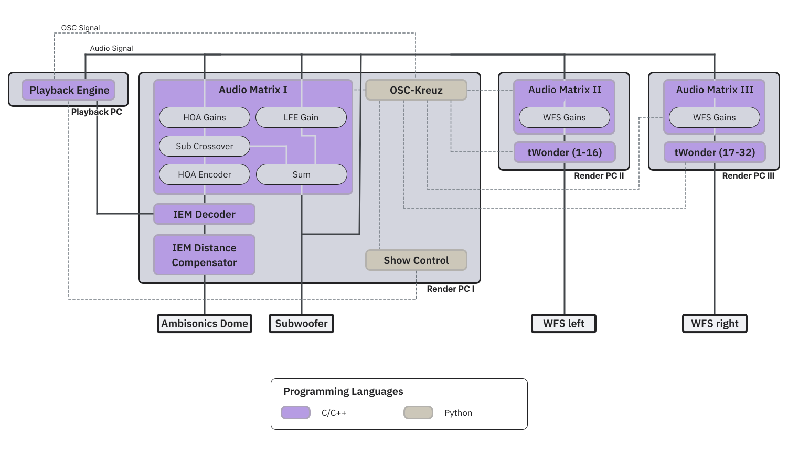

# Signal Flow (Humboldt Forum)

The following flow chart visualizes the interconnection between the software components at Humboldt Forum. Scroll down to get the exact input and output assignment.

## Input-Output Assignment

### Playstation

| Inputs | Description                                  |
| ------ | -------------------------------------------- |
| 1-64   | All 64 channels from the TU Digiface Dante   |
| 65-128 | All 64 channels from the HuFo Digiface Dante |

each group of 64 channels is structured like this:

| Channel(s) | Function                                                     |
| ---------- | ------------------------------------------------------------ |
| 001-032    | Virtual Source channels                                      |
| 033-048    | Direct to 3rd order HOA (lower orders can also be sent here) |
| 050        | Direct to SUB                                                |

The outputs of the Playstation look like this:

| Outputs | Target                                                               |
| ------- | -------------------------------------------------------------------- |
| 1-64    | per-channel sum of TU Digiface Dante, HuFo Digiface Dante and REAPER |

### Renderer 01

| Inputs | Description                                  |
| ------ | -------------------------------------------- |
| 1-64   | All 64 channels from the playstation   |

| Outputs | Target                            |
| ------- | --------------------------------- |
| 1-22    | DAC 1 (Ambisonics speakers 1-22)  |
| 23-44   | DAC 2 (Ambisonics speakers 23-44) |
| 45      | DAC 1 (Ambisonics spekaer 45)     |
| 46-47   | DAC 1 (SUB 1-2)                   |
| 48-49   | DAC 2 (SUB 3-4)                   |

### Renderer 02 and 03

each renderer handles one side of the WFS panels

| Inputs | Description                                  |
| ------ | -------------------------------------------- |
| 1-64   | All 64 channels from the playstation   |

| Outputs | Target                            |
| ------- | --------------------------------- |
| 1-128   | WFS panels  |

---
